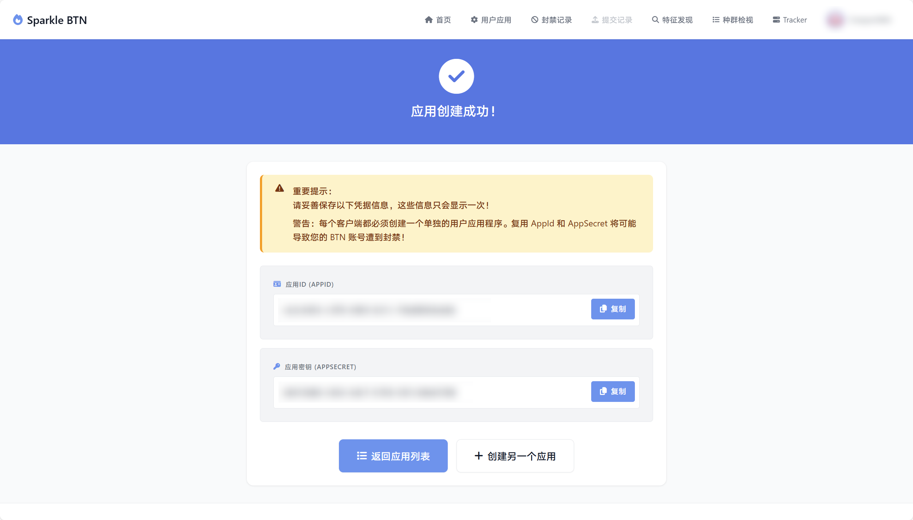
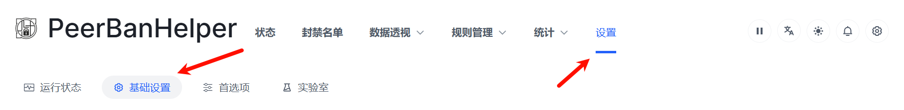
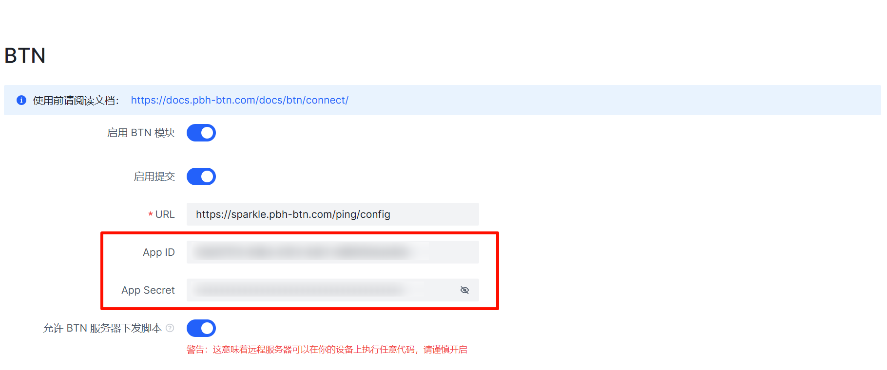
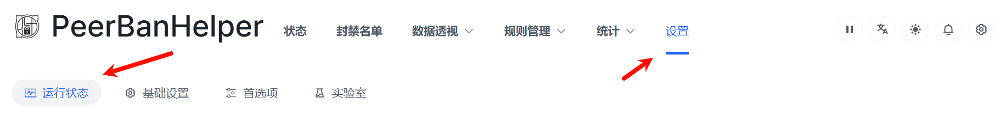
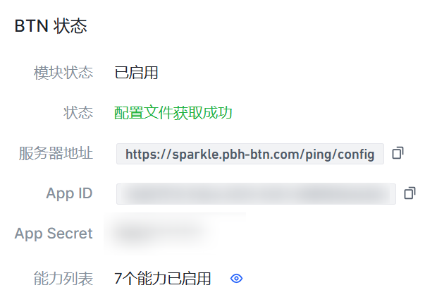

# 连接 BTN

若要参与 BTN 计划，您需要将 PeerBanHelper 作为 BTN 客户端与 BTN 服务器进行连接。本文将以 PBH-BTN 组织运营的官方 BTN 服务器 Sparkle 为例进行演示。如果您希望使用其他 BTN 服务器，请参考对应服务器的文档说明。

## 注册账号并创建 UserApp

要连接到 Sparkle 服务器，首先需要注册一个账户并创建应用程序凭证：

1. 在浏览器中打开 [https://sparkle.pbh-btn.com](https://sparkle.pbh-btn.com) 并使用 GitHub 授权登录，系统将自动为您创建一个账号。

2. 登录后，点击页面中央的 “创建用户应用” 按钮，进入管理页面。

   

3. 点击 “创建新用户应用程序” ，输入一个备注信息后，点击按钮完成创建。

   

4. 请务必记录页面上显示的 `App ID` 和 `App Secret`，因为一旦关闭该页面，`App Secret` 将不再显示。如果您不小心忘记了它们，也可以回到用户应用管理页面重置密钥。

   

## 在 PeerBanHelper 上配置 BTN 连接

获取 App ID 和 App Secret 后，您需要在 PeerBanHelper 中配置连接信息：

1. 打开 PeerBanHelper 的 WebUI ，前往 “设置” -> “基础设置” 选项。

   

2. 向下滑动至 BTN 设置部分，进行如下配置：
   
   - 勾选 “启用 BTN 模块”
   - 在 “App ID” 字段中填入之前获取的 App ID
   - 在 “App Secret” 字段中填入之前获取的 App Secret
   - 在 “配置 URL” 字段中填入服务器地址：`https://sparkle.pbh-btn.com/ping/config`

   

3. 根据您的需求，您还可以配置以下选项：
   
   - **启用提交**：允许 PeerBanHelper 向 BTN 网络贡献检测到的恶意客户端数据，帮助整个社区提高安全性。提交的数据不包含种子的 info_hash 和名称，而是使用不可逆哈希生成的 torrent_identifier 和种子大小，保护您的隐私。
   - **允许 BTN 服务器下发脚本**：允许 PeerBanHelper 接收并执行来自 BTN 服务器的动态脚本，这有助于提高反吸血精确度和效果。**注意：这会允许远程服务器在您的设备上执行代码，仅在连接到受信任的服务器时启用。**

4. 滚动至页面底部，点击 “保存” 按钮，并重启 PeerBanHelper 以使设置生效。

   

## 查看连接状态

配置完成后，您可以查看 BTN 连接状态以确认连接是否成功：

1. 打开 PeerBanHelper 的 WebUI ，前往 “设置” -> “运行状态” 页面。

   

2. 向下滚动页面找到 “BTN 状态” 部分，如果提示 “配置文件获取成功” 则代表连接成功。

   

3. 您可以在 “能力列表” 中查看已启用的能力和该能力的最新状态以及上次更新时间。

完成上述操作后，您就可以享受 BTN 网络带来的集体安全防护能力，同时也在为整个 BTN 社区贡献力量。