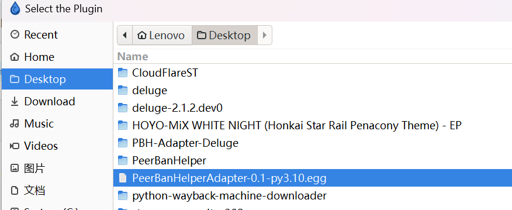

# Deluge

:::warning

所有部署在 Docker 中的下载器，不得使用 bridge 桥接网络模式，必须使用 host 网络模式，以使下载器能够获取正确的 Peer 入站地址，否则 PeerBanHelper 将完全不会工作！

:::

PeerBanHelper 将通过 Deluge 的插件系统连接到 Deluge。

## 安装 PBH-Adapter-Deluge 适配器

首先需要下载 Deluge 适配器：[PBH-BTN/PBH-Adapter-Deluge](releases)，请选择与您的 Deluge 版本匹配的插件 Egg 文件进行下载，如无特殊说明，请下载最新版本。

### Windows 系统安装步骤

1. 在 Deluge 中，选择"编辑"->"首选项"打开配置窗口。

   

2. 转到"插件"菜单，点击"安装插件"按钮。

   

3. 在弹出的选择文件对话框中，选择刚刚下载的 Egg 文件。

   

4. 选择后，插件应该就会安装完成，返回插件菜单，您应该已经看到了 PeerBanHelper 插件，请在前面的复选框中打勾启用，并点击"关闭"保存退出。

   

### Linux 系统安装步骤

对于 Linux 用户，请将下载的 Egg 文件放置在 Deluge 的插件目录中。

## 配置 PBH-Adapter-Deluge 适配器

PBH-Adapter-Deluge 插件安装后会自动启用，无需额外配置。

## 连接到 PeerBanHelper

在 PeerBanHelper 的添加下载器页面，选择 Deluge 下载器。

1. 点击 PBH 的新建下载器按钮，弹出的对话框中选择 Deluge 下载器。

   

2. 填写连接参数：
   * **名称**：起一个自己喜欢的名字
   * **地址**：填写你的 Deluge WebUI 地址
   * **密码**：填写你的 Deluge WebUI 密码
   * **RPC URL**：如果不知道这是什么，请填写 `/json`
   * **增量封禁**：建议启用，可减少对下载器的请求次数
   * **HTTP 版本**：保持默认（HTTP/1.1）
   * **验证 SSL 证书**：如果使用 HTTPS 连接且证书有效，则启用；如果使用自签名证书或不需要验证，则禁用

3. 点击确定保存，即完成添加。