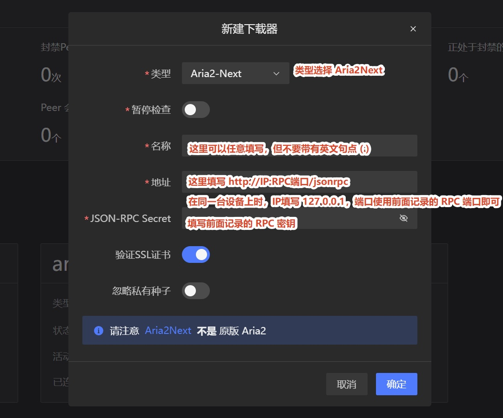

:::danger

**重要提示**: MotrixNext 的支持目前仍处于高度实验性阶段，对于封禁效果和运行稳定性，我们不做任何保证。
:::

:::warning

所有部署在 Docker 中的下载器，不得使用 bridge 桥接网络模式，必须使用 host 网络模式，以使下载器能够获取正确的 Peer 入站地址，否则 PeerBanHelper 将完全不会工作！ 

:::

## 确认版本

PeerBanHelper 所需的 RPC API 仅在 `Motrix Next v3.9.7` 或更高版本中可用。

:::warning
**版本要求**：任何低于此版本的 MotrixNext 均无法使用且不受支持。
:::

## 配置

首先要打开 Motrix Next 的 RPC 远程访问，并记录 RPC 端口和 RPC 密钥，具体可以在下面的位置找到：

然后前往 PeerBanHelper 进行配置即可：

