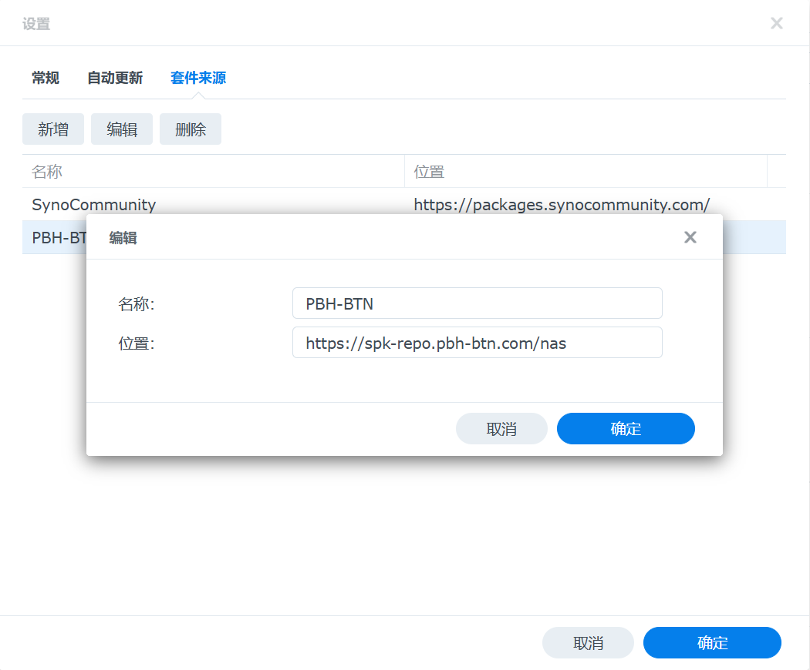

# 使用套件部署

## 添加 PBH-BTN 源至套件中心

登录 DSM 控制台，转到 “套件中心 -> 设置 -> 套件来源” 并如图所示添加 PBH-BTN SPK 套件源：

```
https://spk-repo.pbh-btn.com/nas
```



## 在套件中心安装 PeerBanHelper

成功添加 PBH-BTN SPK 源后，请前往套件中心的“社群”选项卡，并在搜索框中输入“PeerBanHelper”。


找到 PeerBanHelper 套件后，点击“安装”按钮进行安装。


根据安装向导的提示，完成后续的配置流程。

## 配置 PeerBanHelper

安装完成后，PeerBanHelper 将自动创建一个名为“peerbanhelper”的共享文件夹，用于存储所有相关的文件和配置。请注意，虽然可以切换该共享文件夹的存储空间，但对其执行除切换存储空间外的其他操作可能会导致工作异常。


要访问 PeerBanHelper 的 Web 用户界面（WebUI），请在主菜单中找到 PeerBanHelper 的程序图标，并点击以打开 WebUI。


若需管理容器，请在 Container Manager（容器管理器）中找到 PeerBanHelper 的相关项目。


## 配置下载器连接

请确保正确配置网络地址，以确保 PeerBanHelper 能够顺利与下载器进行通信。在同一设备上时，使用 `127.0.0.1` 而非内网 IP 地址。


