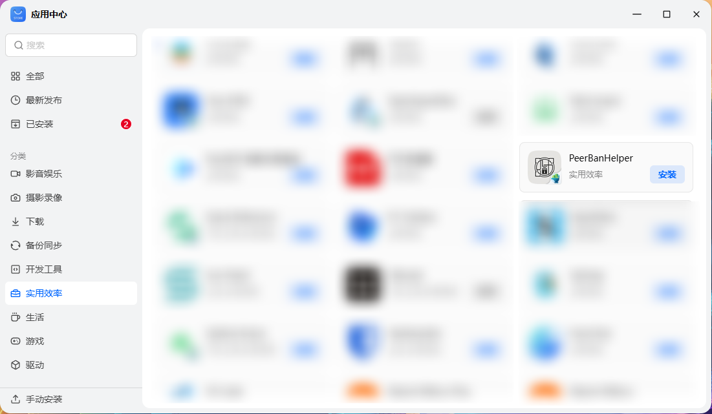
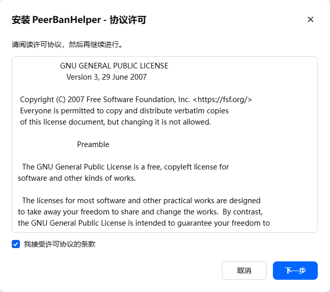
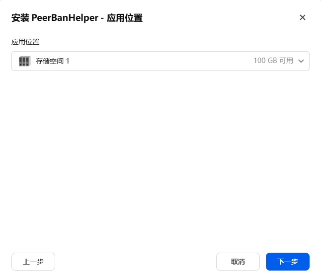

# 使用应用中心部署

:::tip
虽然以下提供了应用中心部署的步骤，但飞牛官方应用审核与更新提交新版本都不积极，如果你迫切需要新版本或获取安全更新，请使用 [手动下载 fpk](./fnapp-peerbanhelper.md) 以确保最新体验。
:::

## 在应用中心安装 PeerBanHelper

使用 APP/WebUI，登录 fnOS/飞牛OS 页面，找到 “应用中心”

1. 在 “应用中心” 左上角搜索，并在搜索框中输入 `PeerBanHelper`

2. 在 “应用中心” 分类中选中 “实用效率”，找到 “PeerBanHelper”

找到 PeerBanHelper 后，点击 “安装” 按钮进行安装。

## 完成用户向导

你需要同意 BTN-PBH 协议 “我接受许可协议的条款” 并下一步。

选择将 PeerBanHelper 安装在您的存储空间中，并下一步。

最后是欢迎页面，你可以在此再次访问 PBH-BTN 和相关文档，点击下一步即可完成用户向导。

## 找到 PeerBanHelper

安装完成后，PeerBanHelper 将自动创建一个名为 “peerbanhelper” 的应用文件夹，用于存储所有相关的文件和配置。请注意，虽然可以切换该共享文件夹的存储空间，但对其执行除切换存储空间外的其他操作可能会导致工作异常。

要访问 PeerBanHelper 的 Web 用户界面（WebUI），请在以下地方中找到 PeerBanHelper 的程序图标，并点击以打开内嵌 WebUI。

- 应用中心
- 桌面
- 应用抽屉

若需管理容器，请在 “应用中心” 或 “Docker” 中找到 PeerBanHelper 的相关项目。

## 配置下载器连接

请确保正确配置网络地址，以确保 PeerBanHelper 能够顺利与下载器进行通信。在同一设备上时，使用 `127.0.0.1` 而非内网 IP 地址。

