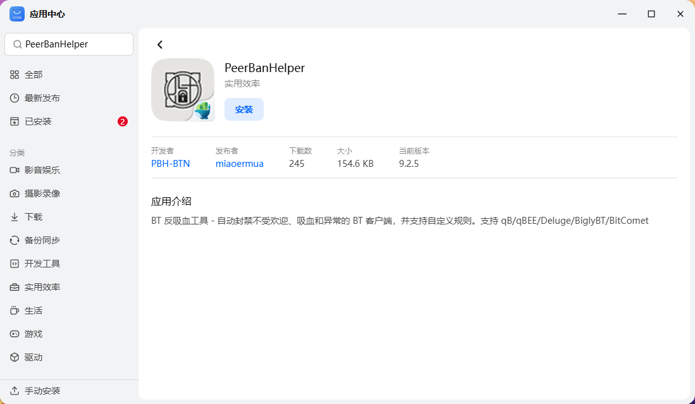

# 手动部署

在 fnOS/飞牛OS 中提供了官方应用商店安装渠道，但飞牛官方应用审核与更新提交新版本都不积极，如果你迫切需要新版本或获取安全更新。

建议完成手动 fpk 下载并部署，绕过 “应用中心” 审核。

## 访问并下载 fpk

在 fnOS/飞牛 OS 打包 [miaoermua/fnapp-peerbanhelper](https://github.com/miaoermua/fnapp-peerbanhelper) 项目中，找到 [Releases](https://github.com/miaoermua/fnapp-peerbanhelper/releases) 下载标有 Latest 版本的 fpk 文件。

例如：`peerbanhelper-9.X.X.fpk`

## 手动安装 fpk

使用 APP/WebUI，登录 fnOS/飞牛OS 页面，找到 “应用中心”。

左下角 “手动安装”，上传 PeerBanHelper 的 fpk 包。

此时会提示 “未检验应用的安全提示”，点击 “同意” 接着按照用户向导完成 PeerBanHelper 安装或更新。

其他步骤与具体详情和[使用应用中心部署](./fn-appcenter.md) 相关。