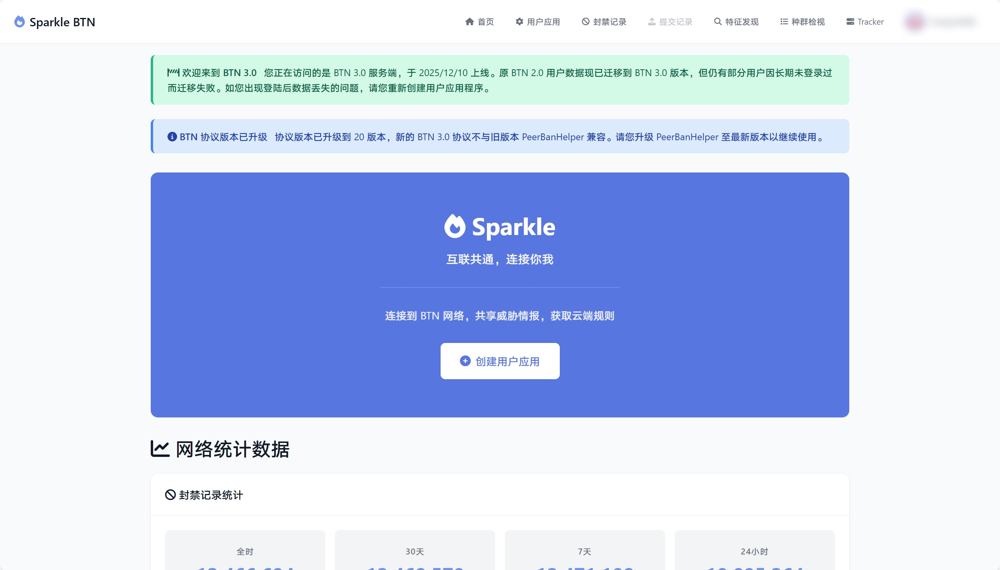
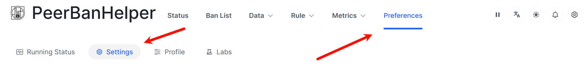
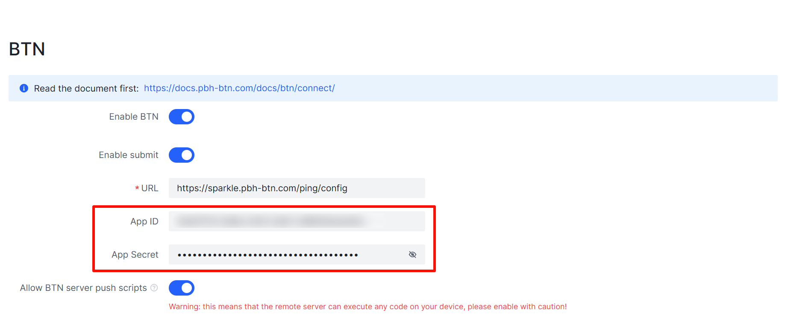
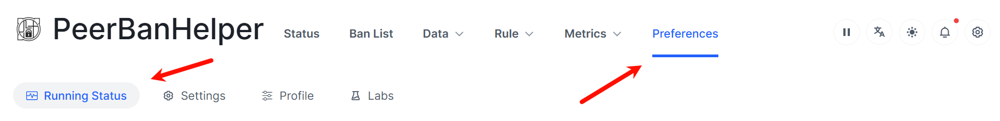
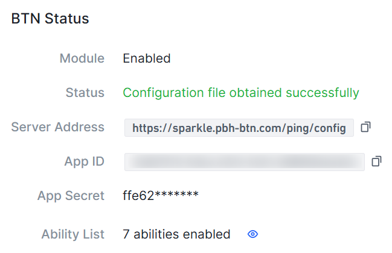

# Connect to BTN

To participate in the BTN program, you need to connect PeerBanHelper as a BTN client to a BTN server. This article uses PeerBanHelper as the BTN client and Sparkle, the official BTN server operated by the PBH-BTN organization, as an example. If you wish to use another BTN server, please refer to the documentation of the corresponding server.

## Register an Account and Create UserApp

To connect to the Sparkle server, you first need to register an account and create application credentials:

1. Open your browser and go to [https://sparkle.pbh-btn.com](https://sparkle.pbh-btn.com) and log in with GitHub authorization. The system will automatically create an account for you.

2. After logging in, click the "Create User App" button in the center of the page to go to the management page.

   

3. Click "Create New User Application", enter a note, and click the button to complete the creation.

   

4. Be sure to record the `AppID` and `AppSecret` displayed on the page, as the `AppSecret` will no longer be displayed once you close this page. If you accidentally forget them, you can also reset the key by returning to the user application management page.

   

## Configure BTN Connection on PeerBanHelper

After obtaining the AppID and AppSecret, you need to configure the connection information in PeerBanHelper:

1. Open the PeerBanHelper WebUI and go to the "Settings" -> "Basic Settings" option.

   

2. Scroll down to the BTN settings section and configure as follows:
   
   - Check "Enable BTN Module"
   - Fill in the previously obtained AppID in the "AppID" field
   - Fill in the previously obtained AppSecret in the "App Secret" field
   - Fill in the server address in the "Configuration URL" field: `https://sparkle.pbh-btn.com/ping/config`

   

3. Depending on your needs, you can also configure the following options:
   
   - **Enable submit**: Allows PeerBanHelper to contribute detected malicious client data to the BTN network, helping the entire community improve security. The submitted data does not include the torrent's info_hash and name, but uses an irreversible hash-generated torrent_identifier and torrent size to protect your privacy.
   - **Allow BTN server push scripts**: This option will allow BTN server push scripts to your device, this may increase the accuracy of the ban. **Warning: This allows the remote server to execute code on your device. Only enable this when connected to a server you fully trust!**

4. Scroll to the bottom of the page, click the "Save" button, and restart PeerBanHelper for the settings to take effect.

   

## Check Connection Status

After configuration, you can check the BTN connection status to confirm that the connection was successful:

1. Open the PeerBanHelper WebUI and go to the "Settings" -> "Running Status" page.

   

2. Scroll down the page to find the "BTN Status" section. If the message "Configuration file obtained successfully" is displayed, the connection is successful.

   

3. You can view the enabled capabilities and their "Last Status" and "Last Update Time" in the "Ability List".

After completing the above operations, you can enjoy the collective security protection capabilities brought by the BTN network, while also contributing to the entire BTN community.