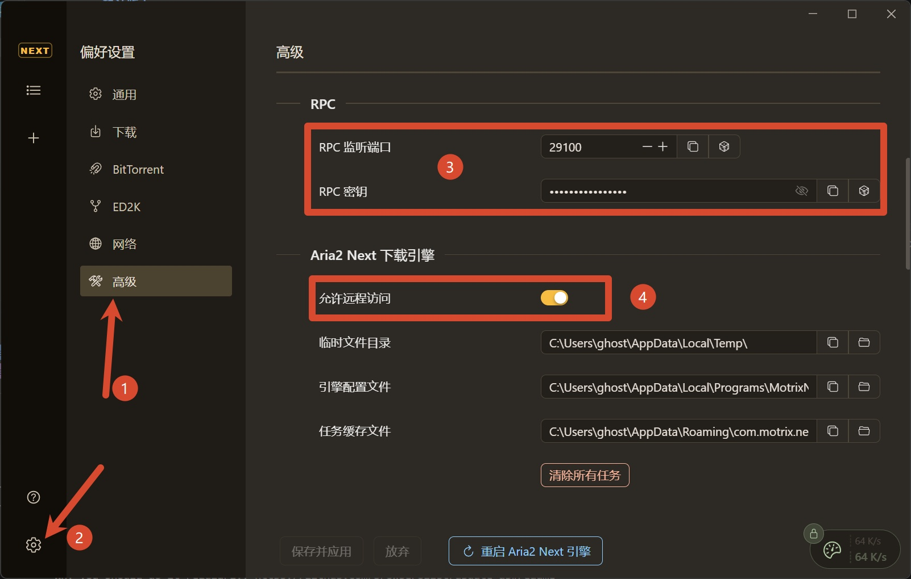

:::danger

**Important Notice**: Support for MotrixNext is still highly experimental. We make no guarantees regarding its blocking effectiveness or operational stability.
:::

:::warning

All downloaders deployed in Docker must NOT use the bridge network mode. They MUST use the host network mode to allow the downloader to obtain the correct inbound peer addresses. Otherwise, PeerBanHelper will not work at all!

:::

## Version Confirmation

The RPC API required by PeerBanHelper is only available in `Motrix Next v3.9.7` or later.

:::warning
**Version Requirement**: Any MotrixNext version below this release is not usable and is unsupported.
:::

## Configuration

First, enable RPC remote access in Motrix Next and record the RPC port and RPC secret key. You can find these settings in the location shown below:

Then go to PeerBanHelper to configure it:

